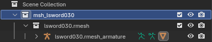
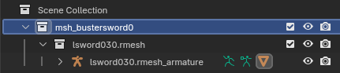
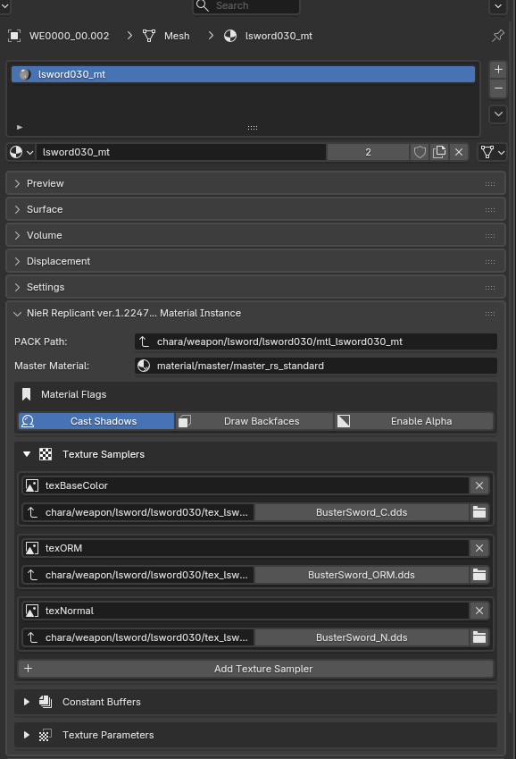
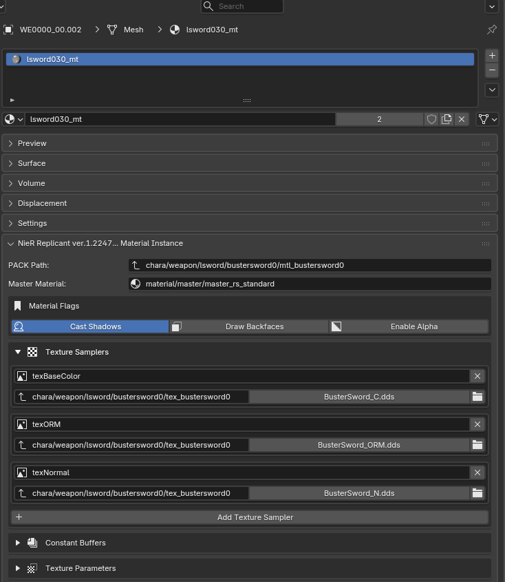
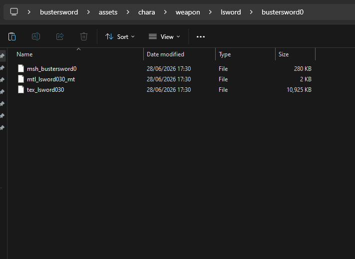

# Creating custom weapons

This guide tells you how to make a fullly custom weapon that can be obtained, instead of just a model swap.

This guide assumes you already know how to do a model swap mod.

Versions used:
```
Blender 5.1.2  
Replicant2Blender 0.15.0  
Unsealed Verses 1.0.5 << IMPORTANT - USE THIS OR GREATER
```

### Need help

For questions about this guide, Lunar Tear, or Unsealed Verses ask me on discord (username: ifaifaifaaaa). For other questions about making models or model swap mods (you will need to know how to do this before using this guide and im personally not sure of the best processes), it may be better to ask on the Nier modding discord server.


### Step 1

Start with a blender scene which you used to create a model swap mod. Pick a name for your new weapon, no spaces, numbers or capital letters. Make sure your name is unlikely to conflict with any name that other mod makers may choose. In the explorer in blender, rename the collection from the original replaced weapon with your new weapon. Add a 0 on the end, and msh_ to the beggining. You can change the other 2 if you want probably, but it doesn't really matter so i don't do it.


Before:



After:




### Step 2

In the material editor, for all your materials, change `Pack Path` to have the material file in a seperate folder with your weapon name with the 0 on the end. Do the same for the texture paths too under `Texture Samplers`.

Before:



After:



If you want, you can change the names of the actual files and the paths too. It may help you keep track of it in your head and not get confused, especially if your new weapon has multiple materials. Remember to keep track of that name and keep it consistent. But for this tutorial im going to do the bare minimum to keep it working. I would reccomend you do too unless youve done this before.

### Step 3

Export your mesh, material and texture as normal.
Place them all in a folder structure similar to what you do for a model swap, but with your new weapon name with a 0 on the end. Note that the material file and texture file is the old name. Thats fine, becuase the game finds the material file from the mesh file, and the texture file from the material file. Since were in a completely new folder, this is all fine.




### Step 4

Now if you want different levels to have different models, youl want to repeat steps 1-3 for each stage of the model, but changing the 0 you put on the end of your name with the level you want. 0 = level 1, 1 = level 2, and so on. In the guide, we put 0 at the end of the level, creating only the level 1 model. But if you are using the same model for all levels thats fine, we will simply tell the game to always look for our level 1 (bustersword0) model.

We need to create weapon assets using Unsealed Verses (on the github releases page). The commands looks like:

```
UnsealedVerses.exe create-weapon-asset chara/weapon/lsword/bustersword0/msh_bustersword0 bustersword0
UnsealedVerses.exe create-weapon-asset chara/weapon/lsword/bustersword0/msh_bustersword0 bustersword1
UnsealedVerses.exe create-weapon-asset chara/weapon/lsword/bustersword0/msh_bustersword0 bustersword2
UnsealedVerses.exe create-weapon-asset chara/weapon/lsword/bustersword0/msh_bustersword0 bustersword3
```

Those 4 commands create 4 asset files. Asset files are what the game looks at to know where to find the model associated with a weapon. Notice how even though we change the level, its still telling the game to find the exact same model. If you want different models for different levels, you need to point the game to the other models you created by repeating steps 1-3

Youl want to place those 4 files in your own recreation of the folder structure where your model files are, but this time in `snow/weapon/`


### Step 5

Archive this all up like usual

```
PS C:\Users\ifaifa\Desktop\bustersword> UnsealedVerses.exe archive busterswordmod.arc assets --index info.arc  --load-type 1
```

### Step 6

Put both the arc files in a new folder, this will be your mod folder. In this new mod folder, creatae a subfolder called `weapons`. In there, create a json file with the name of your mod, e.g. `BusterSword.json`. This is where you will put your weapon paramaters. You can paste in my premade one and edit the paramaters as you see fit:

```
{
    "unique_name" : "ifaifa_BusterSword",
    "asset_name" : "bustersword0",
    
    "display_name" : "Buster Sword",
    "display_desc" : "A large broadsword that has inherited the hopes of those who fight.",

    "display_story1" : "",
    "display_story2" : "",
    "display_story3" : "",
    "display_story4" : "",

    "displacment_on_back" : 0.0,
    "displacment_in_hand" : 0.0,

    "shop_price" : 80000,
    "knockback_precent" : 8,
    "weapon_type" : 1,
    "exclude_from_completion" : true,

    "attack_power" : [395, 640, 710, 755],
    "magic_power" : [140, 150, 160, 175],
    "guard_break" : [195, 200, 205, 215],
    "armour_break" : [90, 93, 95, 110],
    "weight" : [25, 25, 25, 25],

    "recipes" : 
    [
        {
            "cost": 10000,
            "ingredients" : [138, 245],
            "count" : [2, 3]
        },
        {
            "cost": 10000,
            "ingredients" : [138, 245],
            "count" : [2, 3]
        },
        {
            "cost": 10000,
            "ingredients" : [138, 245],
            "count" : [2, 3]
        },
        {
            "cost": 15000,
            "ingredients" : [138, 245],
            "count" : [2, 3]
        }
    ]

}
```


### Step 7

And now your custom weapon is there and workingg! Except theres no way to get it. Youl need to decide how. The most common way is to offer it at a shop. you could also just add it to the players inventory on load, or some other way. No matter what you do, youl need to write a script. It isnt that hard even if you dont know how to code, You can base it off this example which makes it obtainable by the village shop in act 2:

B_CENTER_VILLAGE_01.lua
```lua

ifa_bustersword_B_CENTER_VILLAGE_01_ShopSet = B_CENTER_VILLAGE_01_ShopSet

B_CENTER_VILLAGE_01_ShopSet = function() 

    ifa_bustersword_B_CENTER_VILLAGE_01_ShopSet()

    _AddShopItem(4, _LTGetWeaponID("ifaifa_BusterSword")+1000, 1)


end

```

Basically it finds the function (code) that adds items to the shop, and saves it as `ifa_bustersword_B_CENTER_VILLAGE_01_ShopSet`. Then we the code with our custom function, causing the game to run our code instead, then we call the original and the game doesn`t even know anthing happened.

You should replace both instances of `ifa_bustersword_B_CENTER_VILLAGE_01_ShopSet` with a name unique to you that will definately not conflict with anything ever. Doesn`t matter what it is, as long as both instances are the same. Then replace `ifaifa_BusterSword` with the `unique_name` in your json.

If you want to do any other method of obtaining or you want a different shop and you don`t know how to do it, you can just ask me.

Then create a subfolder in your mod folder called `scripts` and place the lua file in there.

### Step 8

And that should be it. Users will need to install Lunar Tear, and place your mod folder in `[Game]/LunarTear/mods/`.

Heres what your folder structure should look like:

```
busterswordmod
│   bustersword.arc
│   info.arc
│
├───scripts
│       B_CENTER_VILLAGE_01.lua
│
└───weapons
        BusterSword.json
```


and your assets folder before archiving should look like:

```
assets
├───chara
│   └───weapon
│       └───lsword
│           └───bustersword0
│                   msh_bustersword0
│                   mtl_bustersword0
│                   tex_bustersword0
│
└───snow
    └───weapon
            bustersword0
            bustersword1
            bustersword2
            bustersword3

```

No need to keep the assets folder in your final mod.

Does this corrupt save if you delete the mod? No, Lunar Tear makes sure that your save file remains untouched, modded data like which custom weapons the player has are stored in a seperate file in the LunarTear/Gamedata folder. If you delete the mod, the player will no longer be able to use that weapon, but it will not corrupt their save.